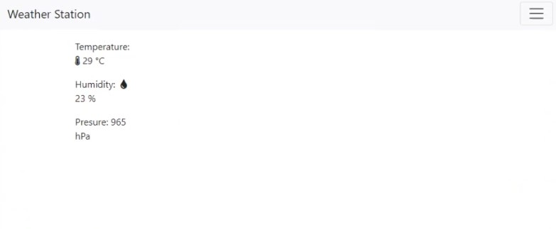
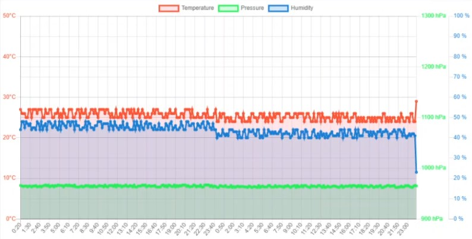

# SteRoP
Projekt stacji metrologicznej na mikrokontrolerze STM32 oraz aplikacji webowej stworzonej na ESP32, korzystając z bazy danych SQLite.

Zdjęcie urządzenia

Zdjęcia aplikacji Webowej

Projekt na Sterowniki Robotów na Politechnice Wrocławskiej

